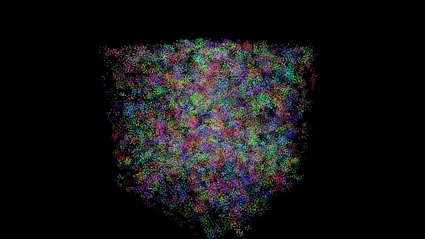
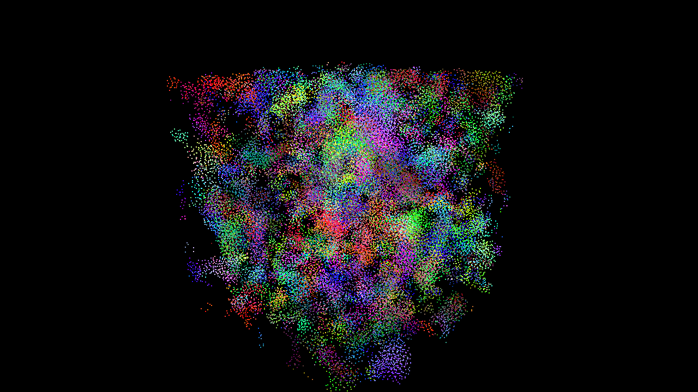
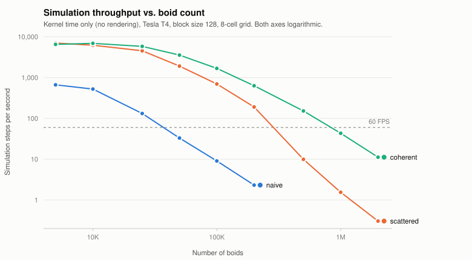
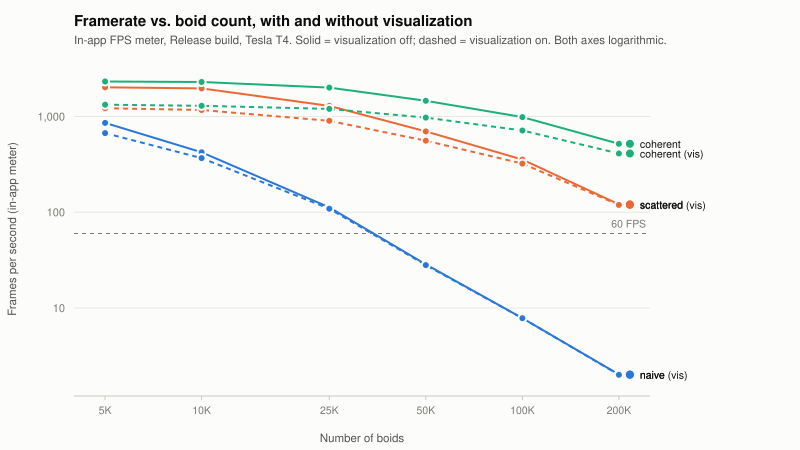
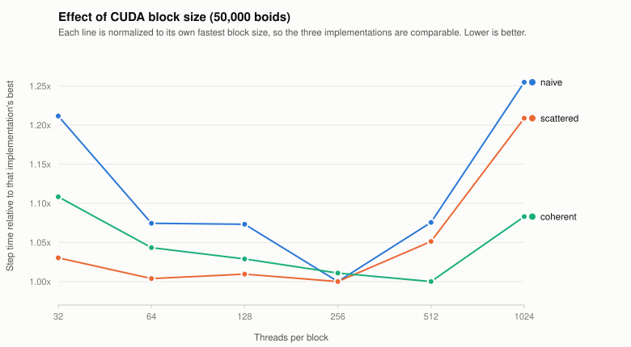
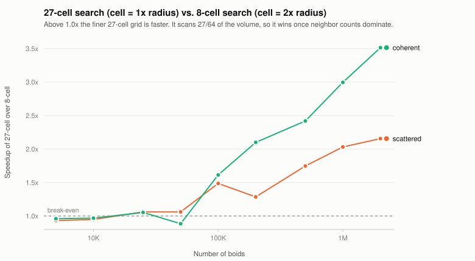

CUDA Boids Flocking
===================

**University of Pennsylvania, CIS 5650: GPU Programming and Architecture, Project 1 - Flocking**

* Josh Kim
* Tested on: Ubuntu 22.04, Intel Xeon (GCP n1 instance), Tesla T4 8GB (SM 7.5), CUDA 13.3, GCC 12.3





*50,000 boids under the coherent uniform grid. Color encodes velocity direction, so a
patch of one color is a group of boids that has agreed on where it is going.*

## What's implemented

* **Part 1 - Naive flocking.** All three Reynolds rules (cohesion, separation, alignment),
  with every boid checking every other boid.
* **Part 2.1 - Scattered uniform grid.** Boids are binned into a uniform spatial grid by
  sorting them on their cell index with `thrust::sort_by_key`, and each boid only examines
  the cells its neighborhood can reach.
* **Part 2.3 - Coherent uniform grid.** The position and velocity arrays themselves are
  reshuffled into cell-sorted order, removing the indirection through
  `dev_particleArrayIndices` in the inner loop.
* **Part 2.2 - Configurable cell width.** `cellWidthMultiplier` in `kernel.cu` switches
  between a cell of two search radii (up to 8 neighbor cells) and one search radius
  (up to 27). Both are measured below.
* **Extra credit - Grid-Looping Optimization.** The neighbor search does not hard-code a
  cell count. It derives the min/max cell index on each axis from the search radius, so it
  visits exactly the cells that overlap the neighborhood and adapts automatically to any
  cell width. This is what makes the 2.2 experiment a one-constant change.

Both grid implementations share a single templated search routine
(`gridNeighborVelocityChange<Coherent>`), and all three implementations funnel their
candidate neighbors through the same `RuleAccumulator`. The physics is therefore identical
by construction, and every difference measured below is purely a difference in *how many*
candidates were examined and *how* they were fetched.

## Correctness

Each implementation was cross-checked against the naive version by stepping the simulation
from an identical initial state and comparing boid positions:

| Steps | Boids | Scattered vs. naive | Coherent vs. naive |
|---|---|---|---|
| 1 | 5,000 | 0.0 | 0.0 |
| 1 | 50,000 | 7.6e-06 | 7.6e-06 |
| 10 | 50,000 | 3.1e-05 | 3.1e-05 |
| 100 | 5,000 | 9.3e-05 | 9.3e-05 |

Agreement is to float rounding. The residual difference comes from summation order: the
naive kernel accumulates neighbors in boid order and the grid kernels in cell order, and
floating-point addition is not associative. Over ~100 steps at 50,000 boids that 1e-7 seed
does amplify - flocking is a chaotic system - so the check is meaningful at low step
counts, which is exactly where it isolates the neighbor search.

The same check passes with `cellWidthMultiplier` set to `1.0f` (27-cell search).

## Performance analysis

**Methodology.** All numbers below are **simulation kernels only**, timed with CUDA events
over a few hundred steps after a 10-step warm-up, with rendering entirely out of the
picture (a separate benchmark harness drives `Boids::stepSimulation*` directly rather than
running the GL loop). This avoids the 60 FPS vsync ceiling and the cost of the
CUDA/OpenGL interop copy, both of which otherwise dominate at small boid counts. The
harness is compiled standalone with `nvcc -O2`, not through the CMake Release target.
That distinction does not affect these kernels: nvcc's `-O` flag governs host code, device
code is optimized by default, and `-G` (which CMake would add in Debug and which really
would wreck the numbers) is never passed. Raw CSVs are in [data/](data/).

The in-app framerate numbers in the next section come from the real application built
through CMake in Release, with the FPS meter logging to stdout and the median taken over
the steady-state window. Two cautions learned the hard way, both worth knowing before
trusting a number from the window title:

* **With `VISUALIZE 0`, the reported framerate is badly wrong for the first several
  seconds.** The only two things that force a GPU sync each frame - `glfwSwapBuffers` and
  the `cudaDeviceSynchronize()` inside `copyBoidsToVBO` - are both compiled out when
  visualization is off. The CPU loop then races ahead queueing asynchronous kernel
  launches, and the meter counts loop iterations rather than completed simulation steps.
  At 200,000 boids the naive build reports a steady **164 FPS** before settling to its
  true **2.3 FPS** - wrong by 70x, and stable enough while wrong to look believable.
* **This GPU's clock is not constant.** The T4 is a 70 W passively-cooled card that
  power-caps under sustained load, so a short warm-up measures a different clock than a
  long one. Every measurement here warms up first, but treat differences smaller than
  about 20% as noise rather than signal.

Note that the simulation domain is a fixed 100-unit cube, so **raising the boid count
raises the density**. Every implementation therefore faces more neighbors *per boid* as N
grows - the grid prunes the search space, but it cannot prune boids that are genuinely
nearby.

### Framerate vs. number of boids



| Boids | Naive (ms) | Scattered (ms) | Coherent (ms) | Naive (FPS) | Scattered (FPS) | Coherent (FPS) |
|---:|---:|---:|---:|---:|---:|---:|
| 5,000 | 1.51 | 0.14 | 0.15 | 664 | 7009 | 6512 |
| 10,000 | 1.91 | 0.16 | 0.15 | 524 | 6201 | 6882 |
| 25,000 | 7.59 | 0.22 | 0.17 | 132 | 4527 | 5821 |
| 50,000 | 30.34 | 0.52 | 0.28 | 33 | 1914 | 3552 |
| 100,000 | 110.41 | 1.43 | 0.60 | 9.1 | 698 | 1679 |
| 200,000 | 429.71 | 5.26 | 1.58 | 2.3 | 190 | 632 |
| 500,000 | - | 100.66 | 6.58 | - | 9.9 | 152 |
| 1,000,000 | - | 645.79 | 23.16 | - | 1.5 | 43 |
| 2,000,000 | - | 3270.17 | 89.34 | - | 0.3 | 11 |

**For each implementation, how does changing the number of boids affect performance? Why?**

*Naive* degrades as a clean O(N²): each 2x in boid count is very close to a 4x in step time
(25K -> 50K: 7.59 -> 30.34 ms, a 4.0x). Every boid reads every other boid's position and
velocity regardless of distance, so the work is quadratic no matter how the boids are
arranged. It falls below 60 FPS somewhere around 37,000 boids.

*Both grid implementations* are dramatically faster and stay nearly flat up to ~25,000
boids, where the per-boid neighbor count is still small and the kernel is dominated by
fixed costs (the sort, the buffer resets, the launch overhead). Past that they start
climbing superlinearly - but for a different reason than the naive version. The grid has
already discarded the far-away boids; what remains is that density is rising, so the number
of boids genuinely inside a cell grows linearly with N, and each of them is examined by
every other boid in the neighborhood. The asymptotics come back, just with a much smaller
constant and only over the local population.

*Scattered vs. coherent* is where it gets interesting. They are within noise of each other
below 25,000 boids, then diverge hard: 1.9x apart at 50,000, 3.3x at 200,000, and **15x at
500,000** (100.7 ms vs 6.6 ms). The scattered version's collapse is not an increase in
arithmetic - both do the same number of distance checks - it is memory. See below.

### Framerate with and without visualization



In-app FPS meter, Release build. "Off"/"On" is the `VISUALIZE` toggle in `main.cpp`:

| Boids | Naive off | Naive on | Scattered off | Scattered on | Coherent off | Coherent on |
|---:|---:|---:|---:|---:|---:|---:|
| 5,000 | 858 | 671 | 2019 | 1220 | 2319 | 1329 |
| 10,000 | 422 | 368 | 1965 | 1169 | 2292 | 1293 |
| 25,000 | 112 | 109 | 1290 | 901 | 2006 | 1202 |
| 50,000 | 28.5 | 28.1 | 699 | 559 | 1458 | 974 |
| 100,000 | 7.8 | 7.8 | 355 | 323 | 986 | 714 |
| 200,000 | 2.0 | 2.0 | 121 | 119 | 518 | 410 |

The gap between the two is the cost of rendering, and it behaves exactly as you would
expect once you see it as a fixed per-boid cost competing with a simulation cost that
grows much faster.

For **naive**, the two curves are indistinguishable past 25,000 boids (28.5 vs 28.1, then
7.8 vs 7.8, then 2.0 vs 2.0). The simulation is so expensive by then that drawing the
points is free by comparison, and turning off visualization buys nothing. Only at 5,000
boids, where a step costs ~1 ms, is rendering worth a visible 22%.

For **coherent**, the gap never closes - 2319 vs 1329 at 5,000, still 518 vs 410 at
200,000. The simulation is fast enough at every size tested that rendering remains a real
fraction of frame time. This is the practical argument for the `VISUALIZE 0` measurement
the instructions ask for: for the fast implementations the visualized framerate is
substantially a measure of the renderer, not of the simulation.

Note that none of these are capped at 60 FPS - vsync is off on this setup, so the meter is
usable as a relative metric.

### Coherent vs. scattered grid

**Did you experience performance improvements with the more coherent uniform grid? Was this
the outcome you expected?**

Yes, and much larger than I initially expected - I was anticipating a modest constant-factor
win, not a 15-37x gap at high boid counts.

The reasoning that predicts a *small* win is: the coherent version removes one indirection
(`particleArrayIndices[k]`), which is one extra load per candidate neighbor. Removing one
load out of three should be worth maybe 30%.

The reasoning that predicts the *actual* win is about cache lines rather than instruction
count. In the scattered version, consecutive `k` within a cell yield boid indices that are
essentially random across the whole array, so each candidate neighbor touches a different
cache sector, and a warp walking a cell issues up to 32 separate 32-byte memory
transactions that each carry one useful 12-byte `vec3`. In the coherent version, `pos[k]` and `vel[k]` for consecutive
`k` are contiguous, so one transaction serves several neighbors and the L1/L2 hit rate for
the cells a warp shares is high.

That distinction is invisible at small N because the whole working set fits in cache
anyway. At 5,000 boids the entire position array is 60 KB. At 500,000 it is 6 MB - larger
than the T4's 4 MB L2 - and the scattered version starts missing all the way to DRAM on
nearly every neighbor. This is why the gap does not merely grow, it explodes right around
the point where the data stops fitting in L2. The single scattered gather that
`kernReshuffleBoidData` performs per frame is trivial by comparison: it is one coalesced
write and one scattered read per boid, versus a scattered read per *neighbor pair*.

### Framerate vs. block size



Step time in ms at 50,000 boids (and 500,000 for the grid implementations):

| Threads/block | Naive @50K | Scattered @50K | Coherent @50K | Scattered @500K | Coherent @500K |
|---:|---:|---:|---:|---:|---:|
| 32 | 35.22 | 0.543 | 0.307 | 78.08 | 7.23 |
| 64 | 31.23 | 0.529 | 0.289 | 102.82 | 6.50 |
| 128 | 31.20 | 0.532 | 0.285 | 101.14 | 6.32 |
| 256 | **29.07** | **0.527** | 0.280 | 97.50 | 6.10 |
| 512 | 31.26 | 0.554 | **0.277** | 94.05 | **5.96** |
| 1024 | 36.47 | 0.637 | 0.300 | 94.85 | 6.10 |

**For each implementation, how does changing the block count and block size affect
performance? Why?**

The effect is real but small - roughly a 20-25% spread across the whole range, against the
orders of magnitude that the algorithm choice is worth. All three implementations show the
same broad shape: a shallow bowl with the optimum somewhere between 256 and 512 threads.

At **32 threads** a block is a single warp, so the SM cannot hide latency by switching to
another warp within the block, and per-block scheduling overhead is amortized over very
little work. Occupancy is also capped by the per-SM block limit rather than by warps.

At **1024 threads** the penalty is granularity. Register and shared-memory budgets are
allocated per block, so a large block is harder to fit, fewer blocks are resident per SM,
and the tail effect gets worse: with 50,000 boids and 1024 threads there are only 49 blocks
across 40 SMs, so load balance is poor and a fraction of the machine idles during the
tail. This shows up most sharply in the naive kernel (+25%), which has the longest and most
variable per-thread loop.

The **256-512 sweet spot** is the usual one: enough warps per block to hide memory latency,
small enough that many blocks are resident and the tail is short.

One genuine surprise: scattered at 500,000 boids is *fastest* at 32 threads (78 ms vs
94-103 ms elsewhere), inverting the pattern every other configuration shows. The plausible
explanation is cache pressure - that kernel is thrashing L2, and fewer concurrent threads
per SM means fewer distinct scattered streams competing for the same cache, so each one
retains more of its working set. It is a symptom of the memory problem the coherent grid
fixes, not a tuning result worth keeping.

### 8 vs. 27 neighbor cells



| Boids | Scattered 8-cell | Scattered 27-cell | Speedup | Coherent 8-cell | Coherent 27-cell | Speedup |
|---:|---:|---:|---:|---:|---:|---:|
| 5,000 | 0.143 | 0.153 | 0.93x | 0.154 | 0.160 | 0.96x |
| 25,000 | 0.221 | 0.208 | 1.06x | 0.172 | 0.163 | 1.05x |
| 50,000 | 0.522 | 0.492 | 1.06x | 0.281 | 0.318 | 0.89x |
| 100,000 | 1.433 | 0.964 | 1.49x | 0.596 | 0.369 | 1.61x |
| 200,000 | 5.255 | 4.086 | 1.29x | 1.583 | 0.754 | 2.10x |
| 500,000 | 100.664 | 57.629 | 1.75x | 6.583 | 2.721 | 2.42x |
| 1,000,000 | 645.785 | 317.912 | 2.03x | 23.164 | 7.733 | 3.00x |
| 2,000,000 | 3270.167 | 1516.633 | 2.16x | 89.344 | 25.423 | 3.51x |

Full sweep: [data/results_cellwidth.csv](data/results_cellwidth.csv).

**Did changing cell width and checking 27 vs. 8 neighboring cells affect performance? Why?**

Yes - and the finer 27-cell grid is **faster**, by up to 3.5x, which is the opposite of what
"27 > 8, so more work" suggests.

The cell count is the wrong thing to compare. What matters is the **volume actually
searched**, because that is what determines how many candidate boids get a distance check.
With a cell width of two search radii, the 8 cells surrounding a boid span a 4r x 4r x 4r
box = **64r³**. With a cell width of one radius, the 27 cells span 3r x 3r x 3r = **27r³**.
The 27-cell search therefore examines about **42% of the volume**, and at uniform density
about 42% of the candidates. Both searches are hunting inside a sphere of radius r whose
volume is only 4.2r³, so both waste most of their work - the finer grid just wastes less.

That predicts a ~2.4x reduction in candidates, which lines up well with the measured 2-3.5x
at large N.

The cost of the finer grid is a larger cell table (42³ = 74,088 cells instead of 22³ =
10,648) and more per-cell bookkeeping: more start/end lookups, more empty cells to skip,
more loop iterations that find nothing. That fixed overhead is why the two are a wash below
~50,000 boids and the 27-cell version is very slightly *slower* at 5,000 - there, the cell
bookkeeping outweighs the candidates it saves. Once density is high enough that examining
candidates dominates, the volume argument takes over completely.

The general lesson is that the right cell width is a function of density, not a constant,
and the "8 vs 27" framing hides that. Because this implementation derives its cell range
from the search radius rather than hard-coding a neighborhood, both configurations run the
same code path.

## Build notes

`CMakeLists.txt` was **not** modified.

On Linux with a CUDA toolkit installed under `/usr/local/cuda`, `find_package(CCCL REQUIRED)`
may fail to locate CCCL even though it ships with CUDA. CMake does not search
`<prefix>/lib64/` for package configs on Debian/Ubuntu (it looks in `lib/` and
`lib/x86_64-linux-gnu/`), and that is where CUDA puts them. Point it at the directory
explicitly:

```bash
cmake .. -DCCCL_DIR=/usr/local/cuda/lib64/cmake/cccl
```

## One base-code change outside the TODOs

`Boids::initSimulation` computed the grid origin with `gridMinimum.x -= halfGridWidth`,
which only produces the right value because `gridMinimum` is a file-scope global that
starts at zero. A second call to `initSimulation` would double it and shift the grid off
the simulation domain. Since `main.cpp` calls it exactly once this was never visible in the
app, but it does bite any test harness that re-initializes - it cost me a confusing
debugging session when my cross-check harness reported that the grid implementations
disagreed with the naive one. Changed to a plain assignment; the single-call result is
identical.
