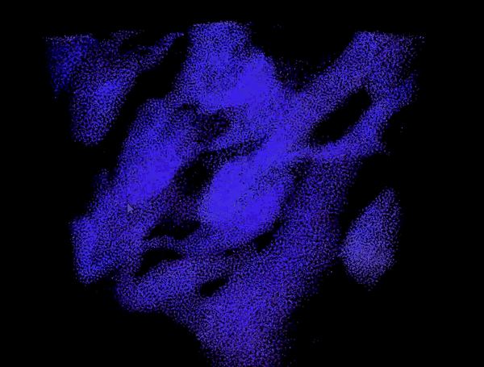
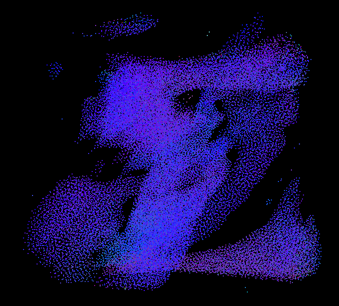
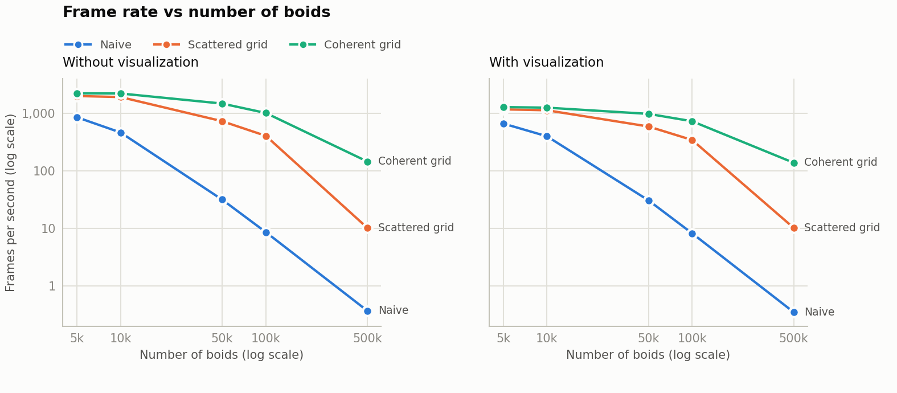
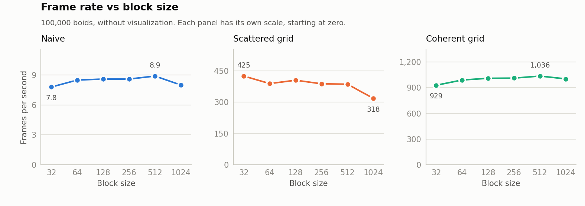

**University of Pennsylvania, CIS 5650: GPU Programming and Architecture,
Project 1 - Flocking**

* Josh Kim
  * [LinkedIn](https://www.linkedin.com/in/euikwang-kim)
* Tested on: Ubuntu 22.04, Intel Xeon @ 2.30GHz (4 vCPUs) 15GB, Tesla T4 15360MB (Google Cloud n1-standard-4) and Windows 11 Education, i7-12700 @ 2.10GHz 32GB, NVIDIA T1000 4GB (SEAS Virtual Lab PC)

*50,000 boids, coherent uniform grid*

## Overview

This project is a flocking simulation written in CUDA. Each boid follows three rules: it moves toward the center of the boids near it (cohesion), keeps a small distance from them (separation), and tries to match their velocity (alignment).

I implemented three versions of the neighbor search:

* **Naive:** every boid checks every other boid.
* **Scattered uniform grid:** the boids are sorted by grid cell every frame, so a boid only checks the boids in the cells that its neighbor distance can reach. Positions and velocities stay in their original order and are looked up through an index array.
* **Coherent uniform grid:** same as the scattered grid, but the positions and velocities are also copied into cell order, so boids in the same cell are next to each other in memory.

## Performance Analysis
All measurements were taken in Release mode on the Google Cloud machine (Tesla T4) listed above. For each setting I let the simulation run for 3 seconds and then averaged the frame rate over the next 5 seconds.

### Number of boids

FPS without visualization:

| Boids | Naive | Scattered grid | Coherent grid |
|---|---|---|---|
| 5,000 | 853 | 1,995 | 2,219 |
| 10,000 | 463 | 1,910 | 2,205 |
| 50,000 | 31.6 | 728 | 1,474 |
| 100,000 | 8.6 | 405 | 1,010 |
| 500,000 | 0.37 | 10.2 | 145 |

FPS with visualization:

| Boids | Naive | Scattered grid | Coherent grid |
|---|---|---|---|
| 5,000 | 663 | 1,169 | 1,281 |
| 10,000 | 398 | 1,127 | 1,251 |
| 50,000 | 30.7 | 589 | 976 |
| 100,000 | 8.2 | 343 | 726 |
| 500,000 | 0.35 | 10.2 | 138 |

### Block size

FPS with 100,000 boids, without visualization:

| Block size | Naive | Scattered grid | Coherent grid |
|---|---|---|---|
| 32 | 7.8 | 425 | 929 |
| 64 | 8.5 | 389 | 990 |
| 128 | 8.6 | 405 | 1,010 |
| 256 | 8.6 | 388 | 1,012 |
| 512 | 8.9 | 386 | 1,036 |
| 1024 | 8.0 | 318 | 1,003 |

### 8 vs 27 neighboring cells
8 cells means the cell width is twice the neighbor distance (`cellWidthFactor 2.0f`). 27 cells means the cell width equals the neighbor distance (`cellWidthFactor 1.0f`).

FPS without visualization:
| Boids | Scattered, 8 cells | Scattered, 27 cells | Coherent, 8 cells | Coherent, 27 cells |
|---|---|---|---|---|
| 50,000 | 728 | 1,007 | 1,474 | 1,618 |
| 100,000 | 405 | 618 | 1,010 | 1,462 |
| 500,000 | 10.2 | 18.0 | 145 | 334 |

## Questions
**For each implementation, how does changing the number of boids affect performance? Why do you think this is?**

More boids made every version slower. The naive version drops the fastest. Going from 50,000 to 100,000 boids cut the frame rate by about 3.7x, and going from 100,000 to 500,000 cut it by about 23x. That is close to N squared, which makes sense because every boid checks every other boid. However, both grid versions barely change between 5,000 and 10,000 boids. This could be because sorting and resetting the grid take about the same time no matter how many boids there are. After that they slow down too. The simulation space stays the same size, so more boids means more boids in each cell and more neighbors to check for every boid. The scattered grid falls off much harder at 500,000 boids (405 FPS down to 10) than the coherent grid does (1,010 down to 145). My guess is that the position and velocity arrays get too big for the GPU's cache at that size, and the scattered version jumps around in them in a random order.

**For each implementation, how does changing the block count and block size affect performance? Why do you think this is?**

Block size did not matter much. The naive and coherent versions were about the same at every block size. The one clear difference is the scattered grid at block size 1024, which was about 20% slower than at 128. I think this is because a block is not finished until its slowest thread is done. In the scattered grid the boids in one block come from all over the space, so some threads have many neighbors and some have almost none. I'm guessing this could cause a very large block to spend more time waiting on its slowest threads. In the coherent grid the boids in a block are close to each other, so they have a similar amount of work.

**For the coherent uniform grid: did you experience any performance improvements with the more coherent uniform grid? Was this the outcome you expected? Why or why not?**

The coherent grid was faster than the scattered grid at every boid count, and the gap grew with the number of boids. I expected it to be faster because the positions and velocities of the boids in a cell are next to each other in memory, and there is one less lookup through the index array. I did not expect the difference to be that large at 500,000 boids. I also thought the extra copy every frame might make it slower at small boid counts but it was still slightly ahead at 5,000.

**Did changing cell width and checking 27 vs 8 neighboring cells affect performance? Why or why not?**

Checking 27 cells was faster in every case I measured. With 27 cells there are more cells to look up, but each cell is half as wide. 8 cells of width 10 cover a 20 x 20 x 20 box, and 27 cells of width 5 cover a 15 x 15 x 15 box. That is about 2.4 times less volume, so there are about 2.4 times fewer boids to test. Searching a smaller space could be faster when there are many boids per cell that causes the cost of testing boids a lot more than looking up cells. However, at lower boid counts the gain is small because the cell lookups matter more.

## Extra credit
Grid-looping optimization
